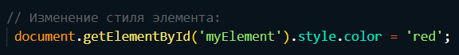
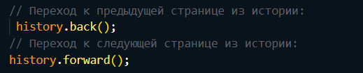
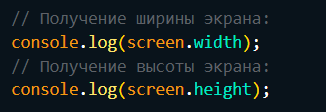
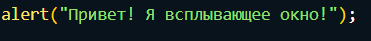
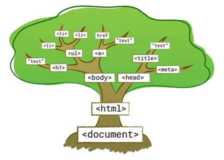

# _DOM_
# _DOM (Document Object Model) – это объектная модель документа, которую браузер создает в памяти компьютера на основании HTML-кода, полученного им от сервера. Иными словами, это представление HTML-документа в виде дерева тегов. DOM обеспечивает представление документа в виде структурированной группы узлов и объектов, которые имеют свойства и методы _
# _BOM_
# _BOM (Browser Object Model) в JavaScript представляет собой набор объектов, предоставляемых браузерной средой. Он позволяет JavaScript взаимодействовать с самим браузером, обрабатывать свойства окна и управлять взаимодействием с пользователем_
# _Вот некоторые ключевые компоненты BOM_
# _1_ _- Объект window: Это корневой объект BOM, представляющий окно браузера. Он служит глобальным объектом для JavaScript в среде веб-браузера _

# _2_ _- Объект document: Хотя он также является частью DOM, он относится и к BOM. Объект document представляет веб-страницу и предоставляет методы для работы с её содержимым _

# _3_ _- Объект navigator: Предоставляет информацию о браузере, такую как его название, версия и платформа _

# _4_ _- Объект history: Позволяет манипулировать историей сессии браузера, управляя навигацией в пределах сессииа _

# _5_ _- Объект screen: Предоставляет информацию об экране пользователя, такую как его ширина, высота и глубина цвета.а _

# _BOM позволяет JavaScript взаимодействовать с браузером и управлять различными аспектами веб-приложений. Это мощный инструмент для создания интерактивных веб-сайтов и приложений_
# _alert_
# _Команда alert() в JavaScript используется для отображения всплывающего окна с сообщением и кнопкой “OK”. Это полезно, когда вы хотите передать информацию пользователю_

# _Особенности DOM_
# _1 _ _-  JavaScript может изменять все элементы HTML на странице._
# _2 _ _-  JavaScript может изменять все атрибуты HTML на странице. _
# _3 _ _-  JavaScript может изменить все стили CSS на странице._
# _4 _ _- JavaScript может удалять существующие элементы и атрибуты HTML. _
# _5 _ _- JavaScript может добавлять новые элементы и атрибуты HTML. _
# _6 _ _- JavaScript может реагировать на все существующие HTML-события на странице _
# _7 _ _-  JavaScript может запускать новые события HTML на странице _
# _Метод querySelector _ _ - возвращает первый дочерний элемент, который соответствует указанному селектору(ам) CSS элемента. Метод запроса Selector All можно использовать для доступа ко всем элементам, которые соответствуют указанному селектору CSS_
# _ innerHTML _ _ - это свойство полностью обеспечивает простой способ заменить элементарный элемент. Например, все требования тело элемента можно удалить_

# _ onclick _ _ - Событие onclick в JavaScript активируется, когда пользователь кликает на определенный элемент страницы, такой как кнопка, ссылка, изображение или любой другой элемент, на который можно нажать_

